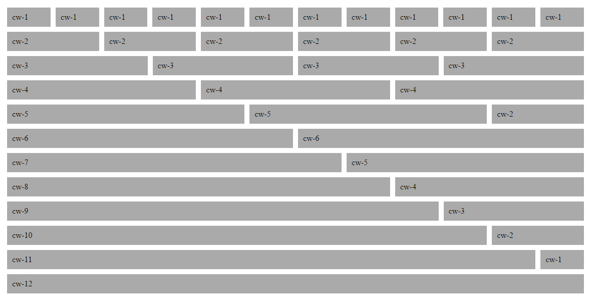

<div align="center"><h1>barebones</h1></div>
<p align="center">Simple semi-responsive css grid</p>
<div align="center"></div>

## Usage

```.container``` for 1140px wide, centered container.

```.frame``` for row. (clearfix and padding), columns(cw) live inside rows.

12 column grid. ```.cw-1``` -> ```.cw-12```


